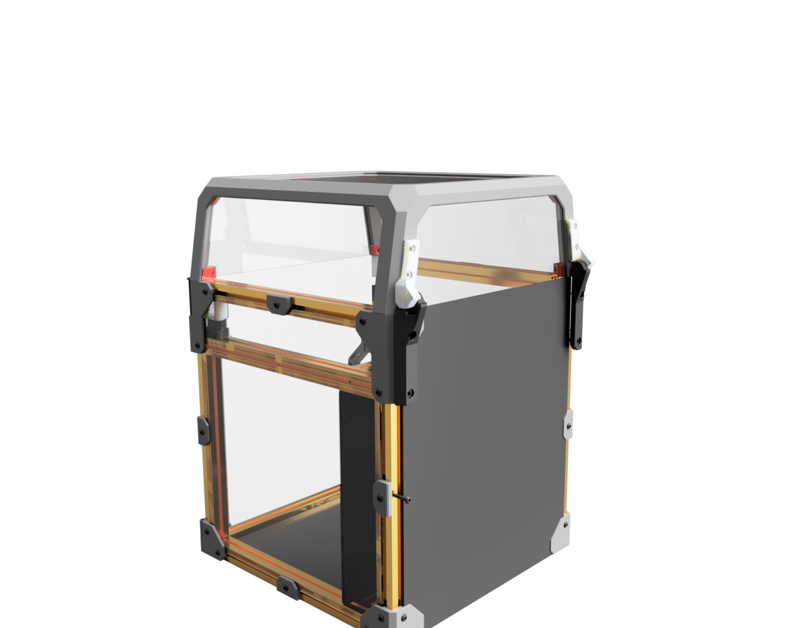
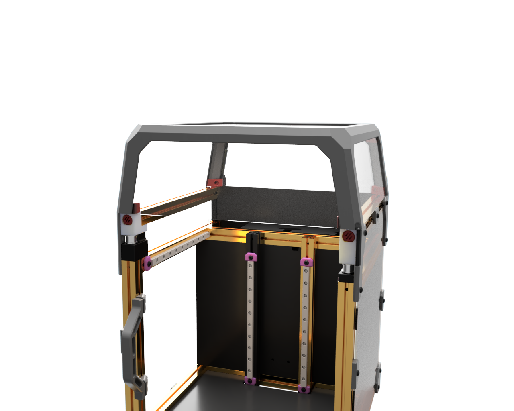

# One & Half Tophat

If you like the hinge and the IKEA style front idler locks of the V0.2, than this is for U

It's as well a migration path until extrusions for the V0.2 tophat become availabe

The design uses the aexat same mount patters for the hinges and the fron locks as the V0.2 tophead

Hint: If you don't like to print a new tophat simply drill in some holes for the m3 inserts

##  See it in Action

