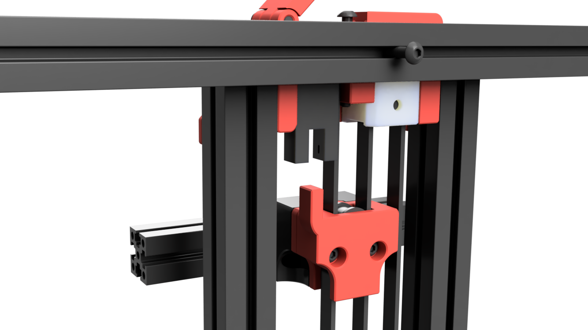

# Opto Z Endstop 

Optical Z endstop. Verry reliable and more than 5mm additional Z travel after the stop has triggered. This prevents nozzle crashers into the bed

Note that this repo only includes the STL's that are different from the original Block and Tackle mod
here: https://mods.vorondesign.com/detail/KeNx5zprqki3m2QAxOx67A

| EE-SX673A-WR | Schema|
|--- |--- |
|  |  | 
| Add one 1k to 4.7k pullup resistor as load between VCC (brown) and Out (black). L (Pink) is not used/connected. VCC and Out will be connected like a traditional microswitch | |
|  Remove the outer wire insulation and the strain relief near the sensor to reduce bulk and allow for easy installation.| |

# BOM

| Item | Source | Notes |
|--- |--- |--- |
| EE-SX673A-WR | https://www.aliexpress.com/item/1005004415419601.html | Multiple Sources |

