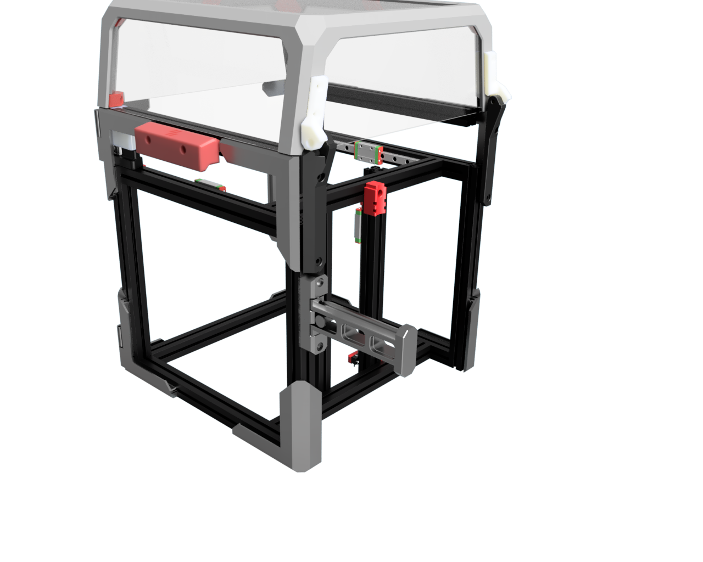

# PIP Holder - Foldable print in place spool holder 

This is a spool holder for the V0.x that can be folded away for transport or simply when not used to save space.

It is a print in place design, so no additional hardware or assembly needed.
The part has a locking mechanism built in to keep it in place when in use.

Make sure that you enforce 0.4mm layer width as recommended by the Voron printing guides.

Note: There is a tiny internal support structure that need to broke on first use. So, don't be surprised if you need a bit of initial force.
After that it should move freely.

