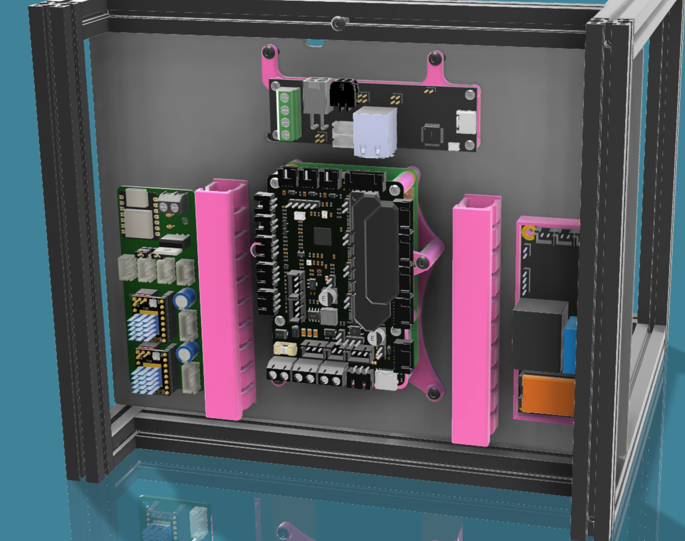
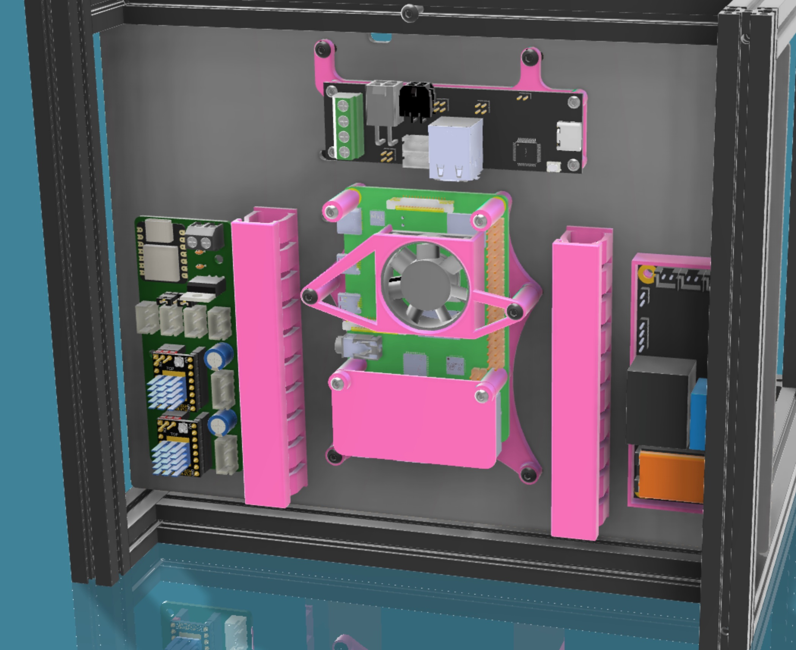
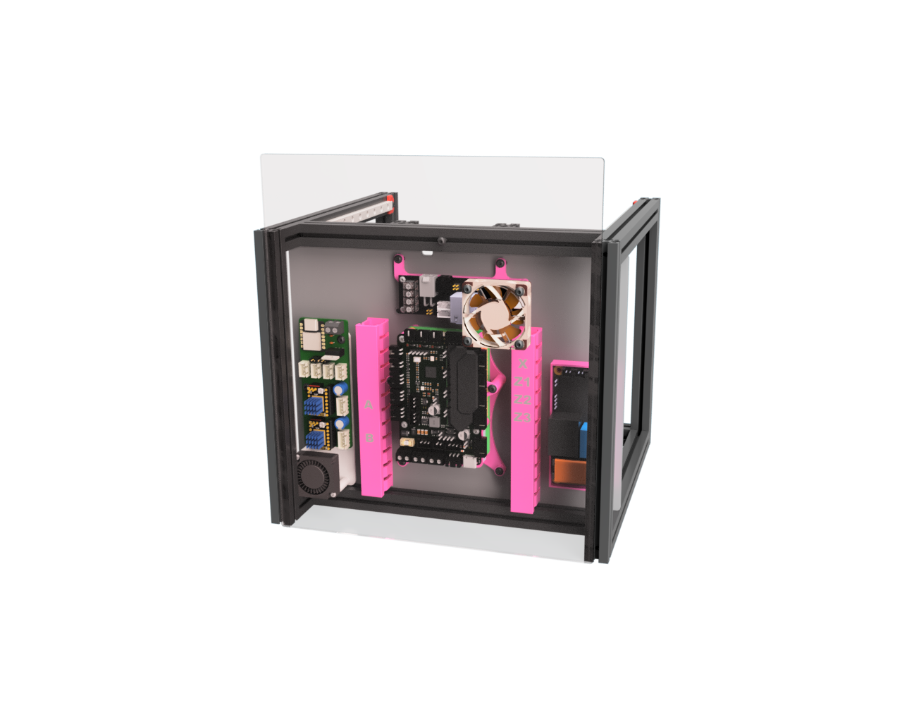

# Pico Pi Mount

A mount for for mounting the SKR Pico an top of a RPI 3 or 4
The mount itself is mounted on the back panel of the V0 using the original pannel screws

# Changelog

## 03.01.23

- Rear-Panel DXF added
- Added CAD with all mounts
- STL's not yet updated
