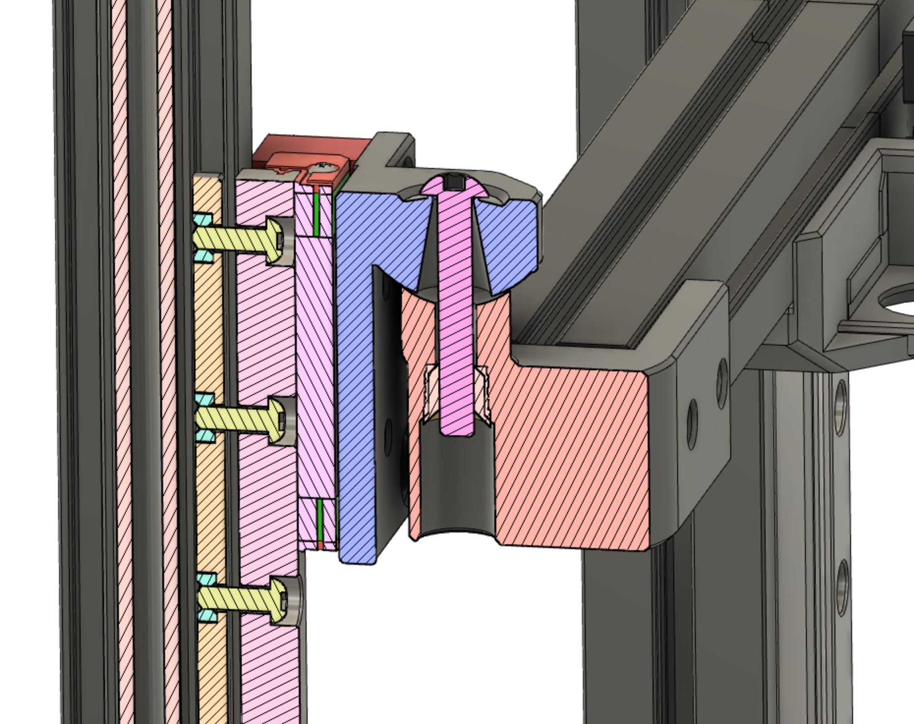
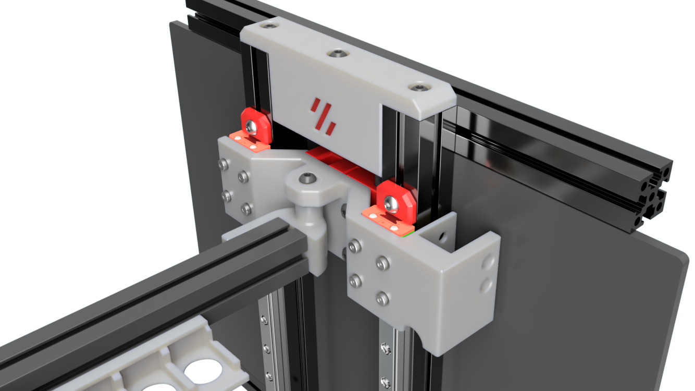
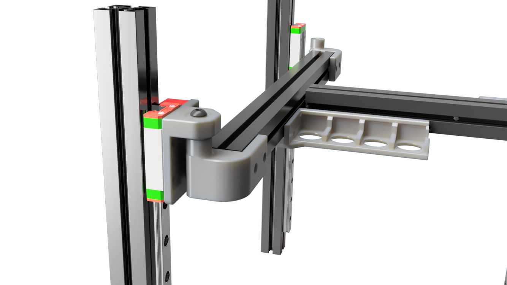
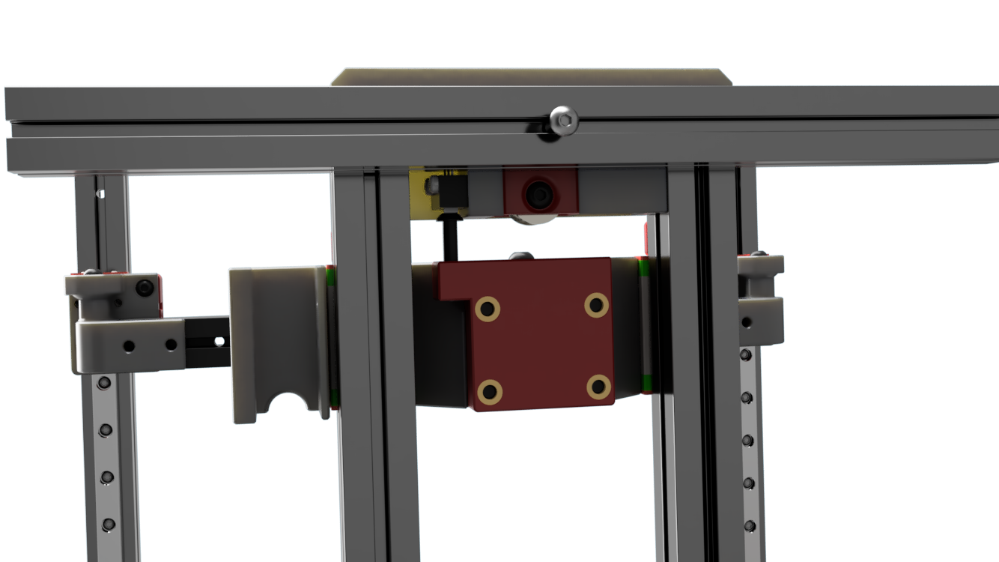

# Tri-Zero - Pivot Bed Mount

A stronger Tri-Zero Bed mount with defined a pivot point

This design also provides an option to go with an Omron microswith as endstop instead of the nozzle probe

This repo only includes the parts that are dofferent fron the standard Try-Zero

## Printimg

Standard Voron settings

The MGN front mount have some built-in break away supportsx

