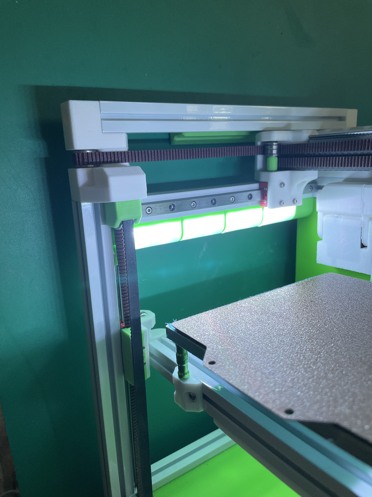

# YALM  - Yet Another LED Mount

Ther are already countless LED mounts for the V0.
However non of them realy made me happy for different reasons.

So here is my aproach.

- Clip on. No screws or preloaded nuts rquired
- no visible cables. Integrated cable channels
- easy to your eyes with the Diffusor mounted on

## BOM

WS2812B - 60LED/m LED NeoPixel Strip - 2 Strips with 8 LED's

## Printing

Voron Settings

Use brims for the diffusors. They have not enough surface to stick on the build plate.
Also rafts dod not work here.

You have the choice for the diffusor material
- clear ABS: Slightly more light
- white ABS: Nice light distribution ans still enough light 

